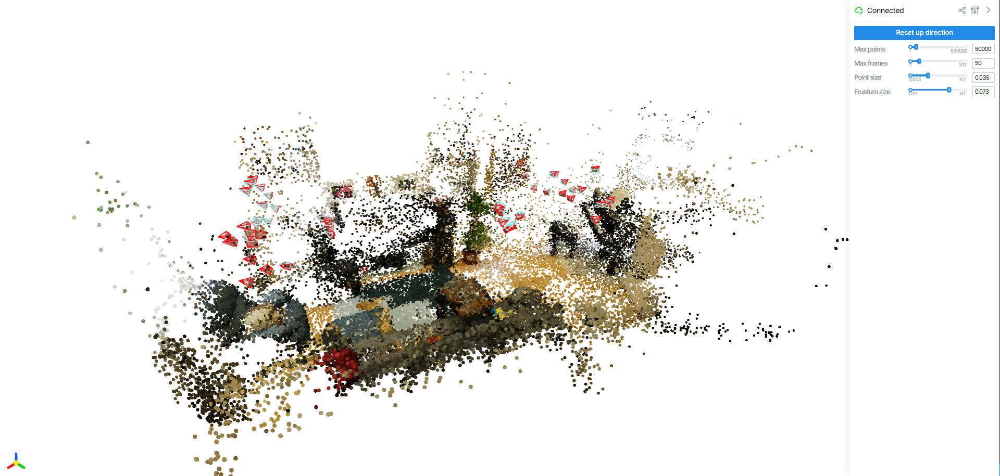

<p align="center">
  <h1 align="center"><strong>   VGGT-X: When VGGT Meets Dense Novel View Synthesis</strong></h1>

  <p align="center">
    <em>Institute of Automation, Chinese Academy of Sciences; University of Chinese Academy of Sciences; Linketic</em>
  </p>

</p>

<div id="top" align="center">

[](http://arxiv.org/abs/2509.25191)
[](https://dekuliutesla.github.io/vggt-x.github.io/)

</div>

<div align="center">
    
</div>


## 📰 News
**[2025.09.30]** Paper release of our VGGT-X on arXiv!


## 💡 Overview

<div align="center">
    
</div>

<b>VGGT-X</b> takes dense multi-view images as input. It first uses memory-efficient VGGT to losslessly predict 3D key attributes. Then, a fast global alignment module refines the predicted camera poses and point clouds. Finally, a robust joint pose and 3DGS training pipeline is applied to produce high-fidelity novel view synthesis.

## ⚡ Quick Start

First, clone this repository to your local machine, and install the dependencies. 

```bash
git clone https://github.com/Linketic/VGGT-X.git 
cd VGGT-X
conda create -n vggt_x python=3.10
conda activate vggt_x
pip install -r requirements.txt
```

Now, put the image collection to path/to/your/scene/images. Please ensure that the images are stored in `/YOUR/SCENE_DIR/images/`. This folder should contain only the images. Then run the model and get COLMAP results:

```bash
python demo_colmap.py --scene_dir /YOUR/SCENE_DIR --shared_camera --use_ga
```

The reconstruction result (camera parameters and 3D points) will be automatically saved under `/YOUR/SCENE_DIR_vggt_x/sparse/` in the COLMAP format (currently only supports `PINHOLE` camera type), such as:

``` 
SCENE_DIR/
  └── images/
SCENE_DIR_vggt_x/
  ├── images/
  └── sparse/
      ├── cameras.bin
      ├── images.bin
      └── points3D.bin
```

Note that it would soft link everything in `/YOUR/SCENE_DIR/` to the new folder `/YOUR/SCENE_DIR_vggt_x/`, except for the `sparse/` folder. It minimizes additional storage usage and facilitates usage of reconstruction results. If `/YOUR/SCENE_DIR/sparse/` exists, it would take it as ground-truth and save pose and point map evaluation result to `/YOUR/SCENE_DIR_vggt_x/sparse/eval_results.txt`. If you have multiple scenes, don't hesitate to try our provided `colmap_parallel.sh` for parallel running and automatic metrics gathering.

## 🔍 Detailed Usage

<details>
<summary>Script Parameters</summary>

  #### --post_fix
  Post fix for the output folder (`_vggt_x` by default). You can set any desired name for the output folder.
  #### --seed
  Random seed for reproducibility.
  #### --use_ga
  If specified, the global alignment will be applied to VGGT output for better reconstruction. The matching results would be saved to `/YOUR/SCENE_DIR_vggt_x/matches.pt`.
  #### --save_depth
  If specified, it would save the depth and confidence to `/YOUR/SCENE_DIR_vggt_x/estimated_depths/` and `/YOUR/SCENE_DIR_vggt_x/estimated_confs/` as .npy files.
  #### --total_frame_num
  If specified, it would use first the `total_frame_num` images for reconstruction. Otherwise, all images will be considered in processing.
  #### --chunk_size
  Chunk size for frame-wise operation in VGGT. Default value is 512. **You can specify a smaller value to release VGGT computation burden**.
  #### --max_query_pts
  Maximum query points for XFeat matching. For each pair, XFeat would generate `max_query_pts` matches. If not specified, it is set to 4096 if number of images is less than 500 and 2048 otherwise. **You can specify a smaller value to release GA computation burden**.
  #### --max_points_for_colmap
  Maximum number for colmap point cloud. Default value is 500000.
  #### --shared_camera
  If specified, it would use shared camera for all images.
</details>

<details>
<summary>NVS Dataset Preparation</summary>

  #### MipNeRF360
  For novel view synthesis on MipNeRF360, please download the `360_v2.zip` and `360_extra_scenes.zip` from [MipNeRF360](https://jonbarron.info/mipnerf360/).

  ```bash
  cd data
  mkdir MipNeRF360
  unzip 360_v2.zip -d MipNeRF360
  unzip 360_extra_scenes.zip -d MipNeRF360
  ```
  #### Tanks and Temple (TnT)
  For reconstruction on TnT dataset, please download the preprocessed [TnT_data](https://huggingface.co/datasets/ZehaoYu/gaussian-opacity-fields/tree/main). More details can be found [here](https://github.com/YuxueYang1204/TrimGS).

  ```bash
  cd data
  unzip TNT_GOF.zip
  ```

  #### CO3Dv2
  Following [CF-3DGS](https://github.com/NVlabs/CF-3DGS) and [HT-3DGS](https://github.com/jibo27/3DGS_Hierarchical_Training), we select 5 scenes from CO3Dv2. The images can be downloaded from [here](https://www.dropbox.com/scl/fi/6lseati34ch9bx1z67ztu/co3d.zip?rlkey=76ssy7p4c4y8pug94b7z62q3e&st=n554skm5&dl=0), and the COLMAP sparse reconstruction results can be downloaded from:
  - Google Drive: https://drive.google.com/file/d/1a0rYyyErzbOofVxwzZ5JSjakeFH4S13o/view?usp=sharing
  - Baidu Netdisk: https://pan.baidu.com/s/1X0NB8ZsgpmN7izcEguSeWA?pwd=41pt

</details>

## 💻 Viser 3D Viewer

Considering the loading and processing of hundreds of images cannot be immediately finished, we provide offline visualization through viser.

```bash
python colmap_viser.py \
   -c /YOUR/SCENE_DIR_vggt_x/sparse/0 \
   -i /YOUR/SCENE_DIR_vggt_x/images \
   -r /YOUR/SCENE_DIR/sparse/0
```

Note that `-i` and `-r` are optional. Set them when you want to show image along with the camera frustum or compare with the ground truth camera poses.

<details>
<summary>Click to preview the Viser interactive interface</summary>

<div align="center">
    
</div>

</details>


## 💕 Integration with Gaussian Splatting


The exported COLMAP files can be directly used with [CityGaussian](https://github.com/Linketic/CityGaussian) for Gaussian Splatting training. This repo is based on [Gaussian Lightning](https://github.com/yzslab/gaussian-splatting-lightning) and supports various baselines such as MipSplatting and MCMC-3DGS. The guidance for joint pose and 3DGS optimization has also been incorporated in our repo.

## 🤗 Citation
If you find this repository useful for your research, please use the following BibTeX entry for citation.

    @misc{liu2025vggtxvggtmeetsdense,
          title={VGGT-X: When VGGT Meets Dense Novel View Synthesis}, 
          author={Yang Liu and Chuanchen Luo and Zimo Tang and Junran Peng and Zhaoxiang Zhang},
          year={2025},
          eprint={2509.25191},
          archivePrefix={arXiv},
          primaryClass={cs.CV},
          url={https://arxiv.org/abs/2509.25191}, 
    }

## Acknowledgements

This repo benefits from [VGGT](https://github.com/facebookresearch/vggt), [VGGT-Low-Ram](https://github.com/harry7557558/vggt-low-vram), [MASt3R](https://github.com/naver/mast3r), [PoseDiffusion](https://github.com/facebookresearch/PoseDiffusion), [3RGS](https://github.com/zsh523/3rgs) and many other inspiring works in the community. Thanks for their great work!


## License
See the [LICENSE](./LICENSE.txt) file for details about the license under which this code is made available.

